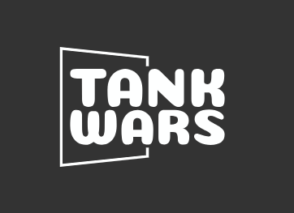

Final group project of the interactive graphics course for the year 2022/2023.

# Game demo

Click here to play the demo of the game [Game demo link](https://sapienzainteractivegraphicscourse.github.io/final-project-tank-wars/)

# Authors:

- Paolo Caruso 1843152
- Cristian Fioravanti 1861593

# Commands

- W: Allows to move the tank forward.
- A: Allows to move the tank left.
- S: Allows to move the tank backward.
- D: Allows to move the tank right.
- F / Mouse click: Allows to shoot with the tank.
- Space: Allows to brake the tank.
- Mouse position: Allows you to direct the tank’s gun toward that position.

## Browsers

We **recommend** to play the game on Chrome for better performances.

## Documentation

Please read the [Report.pdf](./Report.pdf) file.
